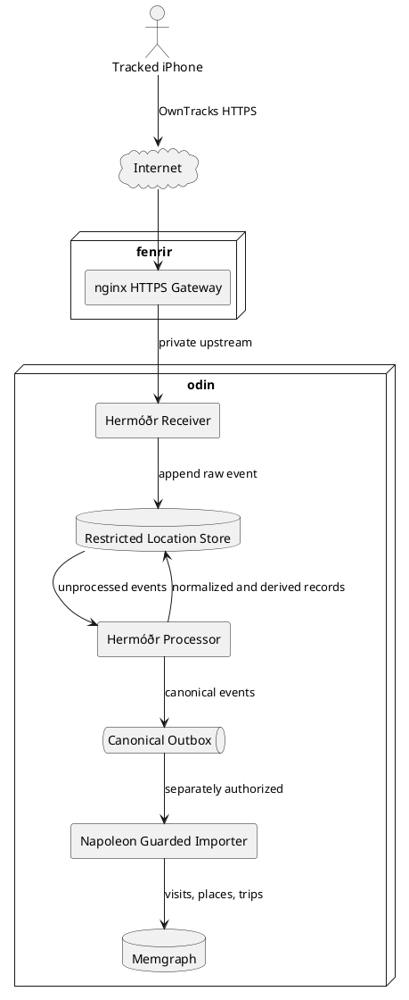

# Hermóðr Product Requirements Document

**Product:** Hermóðr Location Service
**Target host:** Odin
**Status:** Proposed for implementation
**Version:** 1.1
**Date:** 2026-09-10
**Owner:** Bernd Prager

## 1. Executive Summary

Hermóðr is Napoleon's local-first location ingestion capability. Version 1 receives location events from OwnTracks on Bernd's iPhone. Version 2, which shall begin immediately after version 1 acceptance, adds Quinn as a separately isolated tracked subject. Hermóðr stores the original evidence securely, derives normalized observations, visits, places, and trips, and makes approved results available to Napoleon.

Hermóðr shall run on Odin as an independent deterministic service. It is not an LLM agent and shall not depend on OpenClaw or Mimir for normal operation. Napoleon owns the canonical domain contracts, policies, and controlled knowledge integration. Hermóðr owns reliable collection and deterministic processing.

The initial implementation consists of two cooperating processes:

1. **Hermóðr Receiver**, an always-running HTTP ingestion service.
2. **Hermóðr Processor**, a queue-driven or scheduled worker that validates, normalizes, and derives higher-level location events.

Hermóðr shall not write directly to Memgraph in the first release. It publishes canonical records to a guarded outbox that a separately authorized Napoleon importer can consume.

## 2. Problem Statement

Napoleon currently lacks a dependable, privacy-controlled record of Bernd's physical movement and visits. Apple Find My does not expose a supported history API, and depending on an unofficial Life360 interface would introduce external service, privacy, and compatibility risks.

OwnTracks can collect location changes on iOS without creating or signing a custom iPhone application. Hermóðr is required to receive those events, preserve provenance, tolerate intermittent connectivity, and turn raw coordinates into useful personal context without coupling the data collector to Napoleon's core runtime.

## 3. Goals

- Collect OwnTracks location reports from Bernd's iPhone through an authenticated HTTPS endpoint.
- Preserve raw source events as immutable evidence.
- Normalize valid reports into a stable Napoleon-owned location schema.
- Detect known places, arrivals, departures, visits, and trips deterministically.
- Maintain clear authority boundaries between collection, processing, and graph integration.
- Operate locally on Odin with minimal external disclosure of precise coordinates.
- Remain useful when the iPhone or home infrastructure is temporarily offline.
- Provide sufficient health, audit, and diagnostic information for reliable unattended operation.
- Survive planned and unplanned host reboots without losing acknowledged data, manual service recovery, or critical monitoring coverage.
- Add a second tracked subject in version 2 with separate credentials, consent records, data isolation, policy, and deletion boundaries.

## 4. Non-Goals

- Creating a custom iOS tracking application for the initial release.
- Tracking another person without appropriate guardian authorization and the tracked person's informed knowledge and assent or consent, as applicable.
- Using an LLM to validate coordinates or determine basic movement events.
- Continuous turn-by-turn navigation or real-time emergency dispatch.
- Direct Hermóðr writes into Memgraph in version 1.
- Making Hermóðr an OpenClaw agent or requiring Mimir for ingestion.
- Exposing an MQTT broker or database directly to the public Internet.
- Replacing Apple Find My, Life360, or emergency-location services.

## 5. Architectural Decision

Hermóðr is a first-class Napoleon capability implemented as an independent Odin service. This separates the continuous external data stream from Napoleon's core process while keeping storage and processing close to Napoleon and Memgraph.

### 5.1 Deployment Boundary

- Fenrir terminates TLS, limits request size, applies rate limiting, and proxies only the Hermóðr ingestion route to Odin.
- The receiver binds only to Odin's private interface or container network.
- The location store and processor are not externally reachable.
- The Napoleon importer is a separate component with separately configured authority.
- Mimir and OpenClaw may later query approved Napoleon knowledge, but they are not in the ingestion path.

## 6. Users and Stakeholders

### 6.1 Primary User

Bernd, as the version 1 tracked person, data owner, and system operator.

Version 2 adds Quinn as a separately registered tracked subject. Enrollment shall require documented guardian authorization and age-appropriate informed assent or consent. Version 2 data access, retention, export, and deletion policy shall be reviewed before activation rather than inherited implicitly from version 1.

### 6.2 Release Scope

- **Version 1:** one tracked subject and one registered iPhone.
- **Version 2:** two tracked subjects, with one or more separately registered devices per subject and strict subject isolation. Version 2 implementation begins immediately after version 1 acceptance.
- The schema, credential model, queue partitioning, audit model, and canonical contracts in version 1 shall be multi-subject-ready so version 2 does not require destructive migration of version 1 evidence.

### 6.3 System Consumers

- Napoleon timeline and personal context services
- Daily and weekly summary generation
- Memgraph projections for `Person`, `Place`, `Visit`, and `Trip`
- Future Concierge questions such as where time was spent or whether a visit occurred

## 7. Source Behavior and Constraints

- OwnTracks on iOS shall use HTTP mode for the initial release.
- Significant Location Change mode is the default operating mode.
- Selected geofences may generate arrival and departure events independently of general tracking mode.
- Move mode may be enabled temporarily when detailed trip tracking is required.
- iOS controls background execution. Hermóðr must not assume an exact reporting interval.
- Reports can arrive late, duplicated, out of order, or in batches after connectivity returns.
- Lack of reports is not proof that the iPhone remained stationary or that tracking was active.

## 8. Receiver Requirements

### 8.1 Functional Requirements

| ID | Requirement |
| --- | --- |
| RCV-001 | Provide `POST /v1/owntracks` for OwnTracks-compatible JSON payloads. |
| RCV-002 | Require a dedicated Hermóðr credential on every ingestion request. |
| RCV-003 | Accept only HTTPS traffic through fenrir in deployed environments. |
| RCV-004 | Enforce an allowlist of supported OwnTracks message types. Location, transition, waypoint, and status messages shall be handled explicitly. Unsupported types shall be rejected or quarantined with a bounded reason. |
| RCV-005 | Validate content type, payload size, JSON structure, coordinate ranges, timestamp type, and required fields before acceptance. |
| RCV-006 | Assign a server-generated `ingest_id` and `received_at` timestamp to every accepted request. |
| RCV-007 | Preserve the complete accepted source payload and relevant transport metadata without storing credentials. |
| RCV-008 | Compute a server-side content digest and idempotency key. Duplicate deliveries shall not create duplicate canonical observations. |
| RCV-009 | Store accepted events atomically before returning success. |
| RCV-010 | Return a deterministic success or error response suitable for OwnTracks retry behavior. |
| RCV-011 | Place structurally valid but operationally suspicious events in quarantine instead of silently discarding them. |
| RCV-012 | Expose `GET /health/live` and `GET /health/ready` on the private interface. Readiness shall fail when durable storage is unavailable. |
| RCV-013 | Export private operational metrics for accepted, rejected, duplicate, quarantined, and failed events. Metrics shall not contain coordinates. |
| RCV-014 | Support graceful shutdown without losing an acknowledged event. |
| RCV-015 | Resolve every accepted credential and registered device to exactly one configured subject; a request shall not be able to select or override its subject identity. |

### 8.2 Authentication

The MVP may use a high-entropy dedicated bearer token or HTTP Basic credential over TLS, subject to OwnTracks client support. Credentials shall:

- Be unique to Hermóðr and used by no other service.
- Be stored outside source control.
- Be replaceable without rebuilding the service.
- Never appear in access logs, application logs, metrics, or error responses.
- Support an overlap period for safe rotation when operationally practical.
- Be independently scoped and revocable per registered device; version 2 credentials shall not authorize cross-subject submission.

Mutual TLS may be added later if OwnTracks certificate provisioning and maintenance prove reliable. It is not required for the MVP.

### 8.3 Validation Rules

The receiver shall reject:

- Latitude outside `-90` to `90`.
- Longitude outside `-180` to `180`.
- Payloads exceeding the configured maximum size.
- Missing or invalid OwnTracks message type.
- Invalid JSON, non-finite numeric values, or unsupported encoding.
- Events from unknown device or subject identifiers.

The receiver shall accept but flag:

- Events older than the configured lateness threshold.
- Events with poor horizontal accuracy.
- Timestamps materially ahead of receiver time.
- Implausible location changes requiring processor review.

### 8.4 Durability

- An event is acknowledged only after its raw envelope is committed.
- SQLite in WAL mode is the initial durable store.
- Database files shall reside on a dedicated persistent volume with restrictive filesystem permissions.
- Schema migrations shall be explicit, versioned, tested, and reversible through backup restoration.
- The design shall permit later migration to PostgreSQL without changing the external receiver contract.

## 9. Processor Requirements

### 9.1 Functional Requirements

| ID | Requirement |
| --- | --- |
| PRC-001 | Process accepted raw events asynchronously so receiver latency does not depend on enrichment. |
| PRC-002 | Claim work safely so restarts or concurrent workers cannot create duplicate results. |
| PRC-003 | Normalize supported OwnTracks messages into versioned canonical records. |
| PRC-004 | Preserve links from every normalized or derived record to its raw `ingest_id`, source digest, algorithm version, and processing time. |
| PRC-005 | Retain original device time separately from server receipt time. |
| PRC-006 | Represent location accuracy explicitly and prevent low-quality observations from being treated as exact. |
| PRC-007 | Resolve observations against a locally maintained registry of known places and geofence radii. |
| PRC-008 | Detect provisional arrivals, departures, and visits using configurable distance, accuracy, and dwell thresholds. |
| PRC-009 | Detect trips as movement intervals between visits or known places without requiring an LLM. |
| PRC-010 | Reprocess affected time windows when late or out-of-order observations arrive. |
| PRC-011 | Version derivation algorithms and retain the ability to reproduce or replace derived records. |
| PRC-012 | Publish canonical observations and derived events to an append-only outbox. |
| PRC-013 | Prevent direct Memgraph access in version 1. |
| PRC-014 | Record explicit processing states: `pending`, `processing`, `processed`, `quarantined`, and `failed`. |
| PRC-015 | Retry transient failures with bounded exponential backoff and move persistent failures to a reviewable dead-letter state. |
| PRC-016 | Provide a command or private administrative endpoint to reprocess a bounded event or time range. |
| PRC-017 | Generate no unsupported certainty. Gaps, ambiguous visits, and insufficient accuracy shall remain explicit. |
| PRC-018 | Partition claiming, ordering, recomputation, and derivation by `subject_id`; evidence from one subject shall never support another subject's derived record. |

### 9.2 Canonical Location Observation

At minimum, each normalized observation shall contain:

| Field | Description |
| --- | --- |
| `observation_id` | Stable, deterministic identifier |
| `schema_version` | Canonical contract version |
| `subject_id` | Pseudonymous tracked subject identifier |
| `device_id` | Registered source device identifier |
| `source` | `owntracks` |
| `source_type` | OwnTracks message type |
| `captured_at` | Device-reported UTC time |
| `received_at` | Receiver-assigned UTC time |
| `latitude` | WGS84 latitude |
| `longitude` | WGS84 longitude |
| `horizontal_accuracy_m` | Reported horizontal accuracy |
| `altitude_m` | Optional altitude |
| `velocity_mps` | Optional velocity |
| `heading_deg` | Optional heading |
| `battery_percent` | Optional reported battery level |
| `trigger` | OwnTracks trigger or transition reason |
| `connectivity` | Optional source connectivity indicator |
| `quality_flags` | Zero or more bounded validation flags |
| `ingest_id` | Link to immutable raw evidence |
| `source_digest` | Digest of the accepted source envelope |

### 9.3 Derived Records

The processor shall produce:

- **Place:** A known or user-approved geographic area, with a center, radius, label, and sensitivity.
- **Visit:** A bounded interval during which observations support presence at a place or geographic cluster.
- **Trip:** A bounded movement interval connecting two visits or meaningful endpoints.
- **Transition:** A source-reported or derived arrival or departure event.
- **Coverage gap:** An interval where available evidence is insufficient to establish location continuity.

Derived records shall include confidence, supporting observation IDs, algorithm version, creation time, and an explicit status such as `provisional`, `confirmed`, or `superseded`.

### 9.4 Place Resolution

- Known-place matching shall run locally using configured coordinates and radii.
- External reverse-geocoding services shall be disabled by default because queries disclose precise location.
- If external geocoding is later enabled, it shall require explicit configuration, document the provider, apply caching, and avoid sending more precision than necessary.
- Automatically discovered clusters shall remain proposed places until approved or explicitly configured for automatic acceptance.

## 10. Napoleon Integration Contract

Hermóðr shall publish canonical records to an outbox. The outbox consumer is owned by Napoleon and is responsible for policy enforcement and graph projection.

The importer shall:

- Read only committed outbox records.
- Maintain its own idempotent import checkpoint.
- Verify schema version and provenance.
- Reject records outside its declared authority.
- Write only approved entity and relationship types.
- Keep raw coordinates out of Memgraph unless a separately approved use case requires them.
- Prefer summarized `Visit`, `Place`, and `Trip` knowledge over raw observations.
- Preserve uncertainty and coverage gaps.

## 11. Security and Privacy Requirements

| ID | Requirement |
| --- | --- |
| SEC-001 | Classify precise coordinates, visits, trips, and home-location information as `restricted`. |
| SEC-002 | Use TLS for all traffic between the iPhone and fenrir. |
| SEC-003 | Limit the public route to the required HTTP method, path, payload size, and rate. |
| SEC-004 | Keep receiver credentials, encryption keys, and tokens outside source control. |
| SEC-005 | Run receiver and processor as non-root identities with least filesystem and network privilege. |
| SEC-006 | Do not include coordinates, addresses, tokens, or raw payloads in routine logs and metrics. |
| SEC-007 | Maintain an audit trail for credential changes, configuration changes, reprocessing, export, and deletion. |
| SEC-008 | Encrypt backups containing location data and restrict their retention and access. |
| SEC-009 | Provide bounded deletion by subject and time range, including raw, normalized, derived, and outbox records. |
| SEC-010 | Deny access by default when authentication or security configuration is missing or invalid. |
| SEC-011 | Enforce subject isolation in credentials, database queries, processing jobs, outbox records, exports, retention, and deletion workflows. |
| SEC-012 | Require an auditable enrollment and revocation record for every tracked subject and device, including the applicable consent or guardian-authorization basis without storing unnecessary personal details. |

### 11.1 Retention

The initial default is:

- Raw source events: 90 days.
- Normalized observations: 180 days.
- Confirmed visits, places, trips, and coverage gaps: retained until user deletion.
- Operational logs without location content: 30 days.

Retention values shall be configurable globally and overridable by subject policy. Expiration shall be transactional, audited, subject-isolated, and suspended when a record is required to support an unresolved derived event. Before version 1 production activation, Bernd shall explicitly approve or change these defaults. Before version 2 activation, its retention policy shall receive a separate explicit review and approval.

## 12. Reliability Requirements

- Target receiver availability: 99.5 percent monthly on the local infrastructure.
- Target accepted-request latency: below 500 ms at the 95th percentile under expected version 1 load and version 2 aggregate load.
- The receiver shall sustain at least 10 requests per second without data loss, well above expected load.
- Restarting either process shall not lose acknowledged data.
- Duplicate delivery shall not duplicate canonical observations or derived events.
- Backup restoration shall be tested before production activation.
- Clock skew, offline uploads, and out-of-order events shall be handled explicitly.
- Fenrir, the receiver, processor, monitoring collector, dashboard, and alert evaluator shall start automatically after their respective host reboots and recover without operator intervention.
- Persistent database, outbox, backup, and monitoring time-series storage shall reside outside ephemeral runtime filesystems.
- After reboot, expired processor leases shall be reclaimed, pending work shall resume, readiness shall remain false until storage and migrations are usable, and acknowledged data shall remain queryable.
- Critical alerts and dashboards shall resume automatically after reboot. Process-lifetime counters may reset, but durable queue, freshness, backup, integrity, and outbox indicators shall be reconstructed from persistent state.
- A controlled full-path reboot test, including Odin and the relevant fenrir and monitoring services, shall pass before each production release.

## 13. Observability and Operations

Hermóðr shall provide:

- Structured logs with request and ingest identifiers, but no precise coordinates.
- Metrics for ingestion counts, validation failures, duplicates, queue depth, oldest pending event, processing latency, quarantined events, outbox backlog, and last successful iPhone report.
- Multi-subject metrics shall use aggregate counts and worst-case freshness without subject, device, person, or place labels. Identifying the affected subject shall require a restricted administrative diagnostic.
- Critical state-derived metrics shall be reconstructed from the database after process restart. The monitoring time-series database and alert state shall use persistent storage and resume scraping and evaluation automatically after reboot.
- Liveness and readiness checks suitable for container or systemd supervision.
- Alerts for prolonged absence of reports, persistent receiver failures, storage capacity, database corruption indicators, processor backlog, and backup failure.
- A documented runbook covering service restart, token rotation, quarantine review, bounded reprocessing, backup restoration, and emergency endpoint shutdown.

Absence-of-report alerts shall be described as a tracking or connectivity warning, not proof of the user's location or safety.

## 14. Configuration

Configuration shall be environment-based or stored in a protected configuration file and shall include:

- Registered subject and device identifiers
- Per-subject enrollment status, policy reference, and device-to-subject mappings
- Credential references
- Database and outbox locations
- Maximum payload size
- Accepted message types
- Timestamp skew and lateness thresholds
- Minimum acceptable location accuracy
- Known-place coordinates and radii
- Visit dwell and trip segmentation thresholds
- Retention periods
- Log level
- Private health and metrics bindings

Configuration changes affecting derivation shall increment or reference an algorithm configuration version.

## 15. Deployment Requirements

- Hermóðr shall be deployable through Docker Compose or systemd on Odin.
- All production services shall be enabled for automatic startup, ordered after required network mounts and durable storage, and configured with bounded restart backoff.
- Deployment shall use persistent storage outside the container image.
- The receiver and processor may share a release artifact but shall run as separate commands and independently restartable processes.
- Database migration shall complete successfully before the new receiver becomes ready.
- Deployment shall support rollback to the prior application version without discarding newer raw events.
- Monitoring collection, dashboards, and alert evaluation shall use reboot-persistent configuration and storage and shall be included in deployment verification.
- Fenrir configuration shall be maintained separately from the Hermóðr application and tested with a synthetic non-sensitive event.
- No production credential or real coordinate fixture shall be committed to the repository.

## 16. Testing Requirements

### 16.1 Receiver Tests

- Valid OwnTracks location and transition messages
- Invalid JSON and unsupported message types
- Missing and incorrect authentication
- Boundary and invalid coordinates
- Oversized payloads
- Duplicate delivery
- Old, future, and out-of-order timestamps
- Storage failure before acknowledgement
- Graceful shutdown during an in-flight request
- Verification that logs and metrics contain no secrets or coordinates

### 16.2 Processor Tests

- Canonical normalization for every supported source type
- Accuracy-aware known-place matching
- Arrival, departure, visit, and trip derivation
- Late event reprocessing
- Coverage-gap creation
- Restart and duplicate safety
- Algorithm-version changes and supersession
- Retry exhaustion and dead-letter handling
- Outbox idempotency
- Confirmation that no Memgraph connection is required or attempted

### 16.3 End-to-End Tests

- iPhone event through fenrir to durable raw storage
- Offline OwnTracks queue followed by delayed upload
- Receiver restart without acknowledged-event loss
- Processor backlog recovery
- Canonical outbox consumption by a test Napoleon importer
- Backup and restoration into an isolated environment
- Credential rotation and revocation
- Full-path host reboot with automatic gateway, receiver, processor, monitoring, dashboard, and alert recovery
- Reconstruction of critical state-derived metrics after reboot without waiting for a new phone event
- Subject-isolation tests for credential mapping, normalization, derivation, outbox, retention, export, and deletion

## 17. Acceptance Criteria

Version 1 is accepted when:

1. OwnTracks on Bernd's iPhone can submit authenticated events through fenrir.
2. Every acknowledged event is durably stored with provenance and a server timestamp.
3. Invalid and unauthorized requests fail closed.
4. Duplicate and out-of-order events do not corrupt the canonical timeline.
5. Receiver or processor restarts do not lose acknowledged events.
6. Known-place visits and coverage gaps can be derived from a controlled test route.
7. Canonical outbox records are versioned, provenance-linked, and idempotent.
8. Hermóðr runs without OpenClaw, Mimir, an LLM, or direct Memgraph access.
9. Routine logs, metrics, and error responses contain no precise coordinates or credentials.
10. Backup restoration, credential rotation, bounded deletion, and reprocessing are demonstrated.
11. Bernd approves the resulting battery behavior, event frequency, and retention configuration.
12. A full-path reboot recovers ingestion, queued processing, critical metrics, dashboards, and alert evaluation automatically without acknowledged-event loss.
13. The version 1 schema and security model are demonstrated to be multi-subject-ready without exposing subject identity in routine metrics.

Version 2 is accepted when all version 1 guarantees remain satisfied and it additionally accepts independently authenticated events for Quinn, proves cross-subject isolation, and has separately reviewed enrollment and retention policy before activation.

## 18. Delivery Phases

### Phase 1: Secure Collection

- Receiver service
- Fenrir HTTPS route
- Authentication and input validation
- Raw append-only persistence
- Health checks, metrics, and basic runbook
- Synthetic and real-device smoke testing

### Phase 2: Deterministic Processing

- Canonical observation schema
- Processor state machine
- Deduplication and quality flags
- Known-place matching
- Arrivals, departures, visits, trips, and coverage gaps
- Reprocessing and algorithm versioning

### Phase 3: Guarded Napoleon Integration

- Canonical outbox
- Separately authorized Napoleon importer
- Idempotent checkpoints
- Approved Memgraph entity and relationship projections
- Daily timeline integration

### Phase 4: Contextual Use

- Daily and weekly summaries
- Calendar and health correlation
- Concierge queries using derived events
- Optional user-approved place discovery and reverse geocoding

### Phase 5: Second-Subject Support (Version 2, Immediately Following Version 1)

- Quinn enrollment with documented guardian authorization and age-appropriate assent or consent
- Independent device credentials and revocation
- Strict subject isolation in storage, processing, outbox, retention, export, and deletion
- Aggregate privacy-preserving fleet health metrics with restricted subject-level diagnosis
- Multi-subject load, reboot recovery, isolation, and deletion testing
- Separate approval of retention, access, notification, and downstream projection policy before activation

## 19. Risks and Mitigations

| Risk | Mitigation |
| --- | --- |
| iOS delays or suppresses background updates | Use significant-change mode and geofences, retain explicit coverage gaps, never infer continuous presence from silence. |
| Public endpoint attracts abuse | Dedicated authentication, TLS, rate limiting, small request limits, narrow route, fail-closed configuration. |
| Precise location leaks through logs or backups | Restricted classification, coordinate-free logs, encrypted backups, access controls, tested redaction. |
| Duplicate or late events distort visits | Durable idempotency, event-time processing, bounded reprocessing, provisional derived records. |
| Processor algorithm improves over time | Preserve raw evidence, version algorithms, support deterministic reprocessing and supersession. |
| Tight coupling destabilizes Napoleon | Independent service, canonical outbox, separately authorized importer. |
| Excessive raw points overload Memgraph | Keep raw and normalized observations in Hermóðr storage, project only useful semantic records. |
| Reverse geocoding discloses location | Local known-place registry by default, external geocoding disabled unless explicitly approved. |

## 20. Open Decisions Before Production

- Final public hostname and fenrir route.
- Bearer token versus HTTP Basic authentication based on OwnTracks configuration support.
- Docker Compose versus systemd deployment on Odin.
- Confirmation or adjustment of raw and normalized retention periods.
- Initial known-place list and radii.
- Thresholds for accuracy, visit dwell, trip segmentation, and absence-of-report alerts.
- Backup destination and encryption-key recovery procedure.
- Whether OwnTracks Recorder is retained as the raw receiver or replaced by the thin Hermóðr receiver.

## 21. Future Enhancements

- PostgreSQL or time-series storage if additional users or devices are introduced.
- Local reverse geocoding.
- Temporary high-detail trip mode controlled by explicit user action.
- Privacy zones that reduce stored precision around selected locations.
- User-facing correction and annotation workflow for visits and places.
- Additional consented subjects beyond version 2, with strict subject isolation.
- Export in GeoJSON, GPX, or a Napoleon evidence bundle.
- A read-only Hermóðr MCP resource for bounded diagnostic and personal-history queries.
